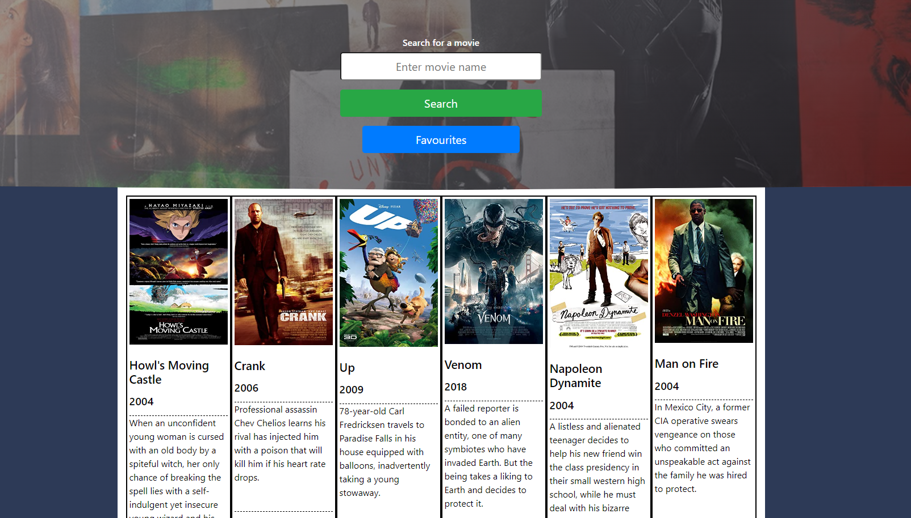
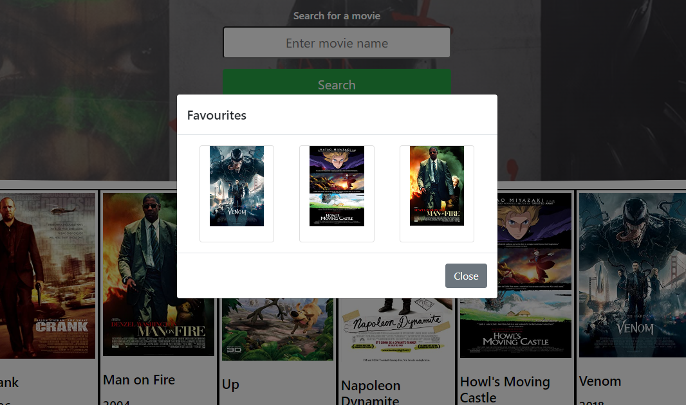
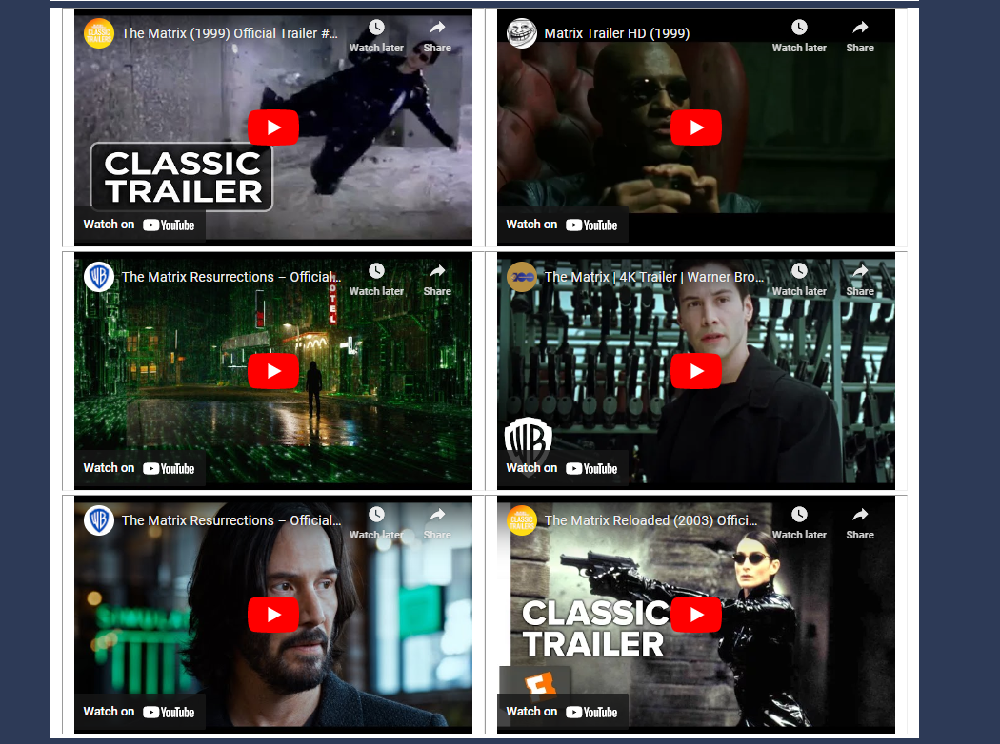

# My Favourite Movies App

## Group Project

Our project involves utilising two API’s to collect data for our user, who intends to search for movies that they are interested in - being able to view details about the movie searched for from data returned from OMDB API and via video content gathered from Youtube's API.   

Our end-user is a movie enthusiast and throughout the years has watched countless numbers of movies that they have found needing to keep a track of. 

Our end-user wants a way to get the latest popular movies available without having to subscribe to a service, our end-user also needs a way to favourite a movie they have searched for. 

Our user wants to be able to view the details of the movie. 

## Usage

There is a main search box, where a user can search for any movie. They are presented with the following results from the OMDB API: 
- Name of movie
- Movie Poster 
- Year of release
- Plot

Once the movie is returned successfully, the user is able to choose from a series of links to related YouTube clips. 
These include trailers, reviews, actors and soundtracks and using the YouTube API a selection of 6 videos are displayed at the bottom of the page.
 
Search history is stored using local storage, and updates to include the 6 most recently searched for movies. Users can also add movies to their favourites list, which is unlimited in length.

Modals are used to display errors in case of a missing or not found movie name in the search box, or no favourites stored. 

Modals are also used to display the results of a current search or favourie clicked.

Here is a mock up of the page:

 
The main page is simple and intuative.

 

When there are favourites stored, these can be accessed in more detail by clicking on the thumbnail image.

 

Youtube clips are displayed at the bottom of the page.

## Credits

This app was created jointly by the following team members: 
https://github.com/Sho-ayb 
https://github.com/rcm6 
https://github.com/GeoBeldi 
https://github.com/Sonia-deni 

[OMDB API] http://www.omdbapi.com/ 
[YouTube API] https://developers.google.com/youtube/v3

## Link to deployed application

https://rcm6.github.io/my-favourite-movies

## License

This project is licensed under the MIT License

## Badges

